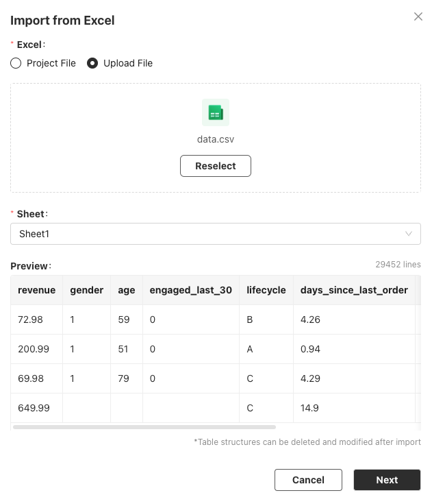

# Your Analysis Flow🔮

Lets walk through most of Bayeslab's important features by doing an analysis on data below


Sample Data File


## Data Import

Let's first import this data and see what the data looks like:

<figure><figcaption></figcaption></figure>

So it's near 30k rows with a few columns like demographic information,  user classification, purchase statistics.&#x20;

Now Next.

<figure><figcaption></figcaption></figure>

Bayeslab has suggested **Type and Description** for this table, and some recommendations for how to make it better for analysis.


Type and Description are pretty **important** for AI to correctly perform actions. Please make sure it's **correct and contain enough details**, especially any particulars that is not common knowledge.

For example

* the **lifecycle** column contains A, B,C levels. It would be good to specify **what these levels mean and if there're other choices**.
* The **gender** column is number, while it's good to specify what each number means.


We know this data is **user behavior** information from an online service, so we change the table name to **user\_behavior**, to better represent the nature of this data set. &#x20;

Then Confirm.

<figure><figcaption>
Preview of Data Table
</figcaption></figure>

## Explore with AI

First let AI analyze this data and see what we can get:

<figure><figcaption>
AI Analysis of Data Table
</figcaption></figure>

It mentions the problem of no clear definition of A,B, C stage (ignore for now), some missing values and    some potential relationships.&#x20;

Good to know.

Also there're some interesting tools below:

<figure><figcaption></figcaption></figure>

### Automatic Charting

Let's try **automatic explore** and see what happens, by clicking **Automatic Charting** and **Run** in the new added block.

<figure><figcaption>
Partial result of automatic charting
</figcaption></figure>

We can see some **automatic analysis and distribution** done, with **observation** of that chart for insights, and some **recommendation** on how to improve the charts.&#x20;

Quite some **knowledge** generated to take in.

### Analysis Ideas

Now we'd like to see what else can we get from this data,  click **Analysis Ideas:**

<figure><figcaption></figcaption></figure>

Some interesting ideas with data need/visual and goals explained.  We'll definitely try some later.&#x20;

## Cleaning/Transformation

Let's get our hands dirty for some direct wresting with the data, say we first do some clean/transformation for this data. The experience is pretty much just say it clearly:

<figure><figcaption>
Simple Cleaning
</figcaption></figure>

You can see the result contains a "Filtered and Normalized DataFrame", clicking it shows the data has been cleaned according to our prompt.

We can continue to massage this data in next block by referencing this result (using // ) and say what we want.&#x20;

<figure><figcaption>
2nd Transformation block
</figcaption></figure>


The result(like Final Result DataFrame) here is temporary and will be cleared when you disconnect with the machine.&#x20;

If you would like to save the result,  you can write back the result by saying "write back" or anything similar like below


<figure><figcaption>
Write back
</figcaption></figure>

## Charting

Let's further analyze by doing visualization, following recommendation from AI in previous steps.

Let's see how age group affects revenue.

<figure><figcaption></figcaption></figure>

You can see the analysis result actually infers a little more about the data using common knowledge , for example 0-20 equals "younger people".&#x20;


You can continue to chat with this chart and provide more context so it can better help.&#x20;

\
For example what kind of product does these revenue represents?  That would help to explain the wierd high spending for 10 years old. (Or it seems the age is skewed or maybe the "age" does not mean year)


### Customize&#x20;

The title and its location does not look good,  we can change it by click "Edit" when hovering on this chart.

<figure><figcaption></figcaption></figure>

For more details, please see [Chart](your-analysis-flow.md#charting).

## Predict

Although we might not understand machine learning in our heart, but we still would like to do some prediction and what-ifs.

<figure><figcaption></figcaption></figure>

With 1 line, we can build a prediction model to predict revenue from age/gender and past order amounts.

And use another line to predict

<figure><figcaption></figcaption></figure>


Please pay special attention to R-squared value in the output.

R² measures how well the independent variables explain the variance in the dependent variable. It ranges from 0 to 1:

* **0**: The model explains none of the variance.
* **1**: The model explains all of the variance.

So in above sample, the model is actually very very bad (R-squared = 0.069). This means the factors we choose doesn't have clear relationship with revenue, or we need to try other models.


## Share

Finally,  someone in our team would like to see this analysis and maybe throw a bunch of questions on his own.

<figure><figcaption></figcaption></figure>

Make sure you check the **"Include data table"** option so your friend would be able to reproduce everything and do more with the data.
